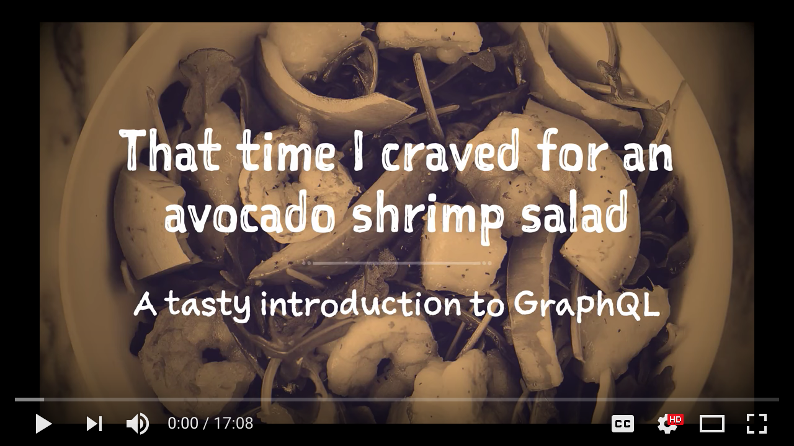

# How to GET shrimp salad at the RESTaurant

> A tasty introduction to GraphQL

## Quickstart

* edit [`index.js`](index.js) to require the step you want to check out
* start with `node index.js`

Questions? Ping me on Twitter [@grm2](https://twitter.com/gr2m)!

## LICENSE

[Apache-2.0](LICENSE)

